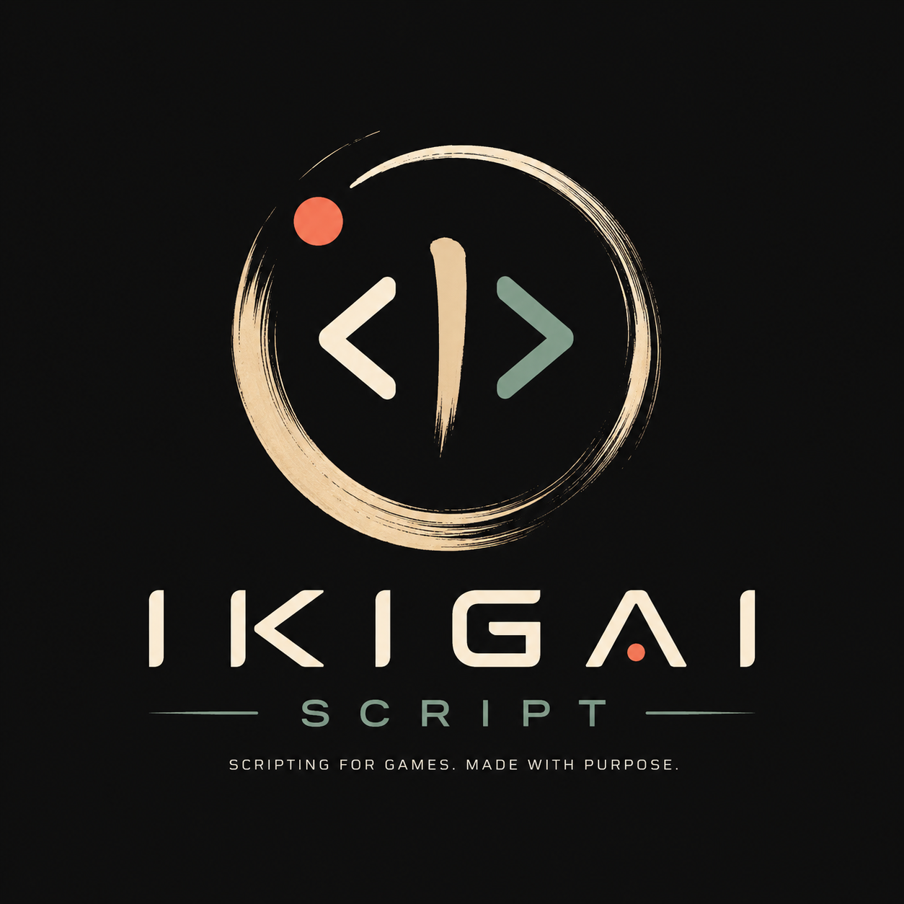

# IkigaiScript (IkigaiScript)



> **Русский:** [README.ru.md](README.ru.md)

IkigaiScript is an embeddable C++20 scripting language with static typing, classes, coroutines, modules, and a dual execution architecture: an **AST interpreter** (default) and a **stack-based bytecode VM**.

Full language reference: [docs/LANGUAGE.md](docs/LANGUAGE.md).

## Quick start

### Build (Windows / CMake)

Default configure builds **core + headless VisualCore + tests** only (no GUI deps):

```powershell
cd IkigaiScript
mkdir build
cd build
cmake ..
cmake --build . --config Debug --target IkigaiScriptTests
.\Debug\IkigaiScriptTests.exe
```

### Visual editor window (optional)

The GUI app (`IkigaiScriptApp`) is **off by default**. Dependencies are **not** git submodules — point CMake at local trees.

| CMake option / path | Meaning |
|---------------------|---------|
| `IKIGAI_BUILD_VISUAL_EDITOR` | `ON` to build the editor window (default `OFF`) |
| `IKIGAI_LIBS_ROOT` | Root with `glfw` / `glew` (e.g. `C:/libs`) |
| `IKIGAI_IMGUI_DIR` | Dear ImGui tree (`imgui.h`, backends, `imgui-node-editor/`, `TextEditor.*`) |
| `IKIGAI_GLFW_INCLUDE_DIR` / `IKIGAI_GLFW_LIB_DIR` | Override GLFW paths |
| `IKIGAI_GLEW_INCLUDE_DIR` / `IKIGAI_GLEW_LIB_DIR` / `IKIGAI_GLEW_BIN_DIR` | Override GLEW paths |

```powershell
cmake .. -DIKIGAI_BUILD_VISUAL_EDITOR=ON `
  -DIKIGAI_LIBS_ROOT=C:/libs `
  -DIKIGAI_IMGUI_DIR=D:/path/to/imgui
cmake --build . --config Release --target IkigaiScriptApp
.\Release\IkigaiScriptApp.exe
```

`IKIGAI_LIBS_ROOT` fills GLFW/GLEW defaults (`glfw-3.4` or `glfw`, `glew`). Fine-grained path variables override those defaults.

### Run a script from C++

```cpp
#include "Library/ikigaiScript.h"

IkigaiScript::IkigaiScriptInterpreter interp;
interp.evaluate(R"(
    var msg = "Hello, IkigaiScript!";
    print(msg);
)");
```

### Run a file

```cpp
interp.evaluateFile("script.ik");
```

## Hello World

```js
print("Hello, IkigaiScript!");
```

## Language highlights

### Types and variables

Static types, nullable annotations, `const`, `dynamic`, and type inference:

```js
var n = 42;
var s: String = "text";
var x: Int? = null;
const PI = 3.14;
dynamic any = 10;
any = "now a string";
```

### Functions and lambdas

```js
fun add(a, b) { return a + b; }
print(add(3, 4));  // 7

var double = fun(n) { return n * 2; };
print(double(5));  // 10

// Variable capture
var base = 10;
var addBase = fun[base](x) { return base + x; };
print(addBase(5));  // 15
```

Named arguments and default values:

```js
fun greet(name, prefix = "Hello") { return prefix + ", " + name; }
print(greet(name = "World"));  // Hello, World
```

### Classes

```js
class Point {
    var x = 0;
    var y = 0;
    fun Point(a, b) { x = a; y = b; }
    fun sum() { return x + y; }
}
var p = Point(3, 4);
print(p.sum());  // 7
```

### Control flow

Statements:

```js
if (n > 0) { print("positive"); } else { print("non-positive"); }

for (i = 0; i < 5; i++) { print(i); }

for (x : 1..=5) { print(x); }  // range: 1..5 inclusive
```

**Expressions** — assign a value from `if`, `for`, `match`, or a block:

```js
var a = if (x > 3) { 100; } else { 0; };

var doubled = for (x : [1, 2, 3]) { x * 2; };   // [2, 4, 6]

var r = match (n) {
    case 1 => { "one"; }
    case 2 => { "two"; }
    default => { "other"; }
};

var sum = {
    var a = 40;
    a + 2;   // 42
};
```

See [docs/LANGUAGE.md](docs/LANGUAGE.md#expression-forms) for more forms.

### Collections

```js
var arr = [1, 2, 3];
print(arr[0]);        // 1
print(length(arr));   // 3

var lst = list(1, 2, 3);
var slice = lst[1..3];  // [20, 30] when lst = [10,20,30,40]

var t = (1, "hello", true);
print(t.0);  // 1
var (a, b) = (10, 20);
```

### Coroutines and concurrency

```js
coro counter(n) {
    yield n;
    return n + 1;
}
var c = counter(10);
print(c());   // 10
print(c());   // 11

var t = counter(5);
var result = await t;
```

See `sync`, `race`, and `spawn` in [docs/LANGUAGE.md](docs/LANGUAGE.md#concurrency).

### Modules

```js
// math.ik
module Math;
export fun add(a, b) { return a + b; }
export var PI = 3.14;

// main.ik
import "math.ik";
print(Math.add(2, 3));
using { add } from Math;
```

### Defer, transactions, live variables

```js
fun demo() {
    defer { print("cleanup"); }
    print("work");
}

var x = 1;
print(>>>{ x = 2; });  // transaction: true on success
print(x);              // 2

var a = 1;
live var b = a + 1;
a = 5;
print(b);  // 6 — recomputed automatically
```

### Result and generics

```js
var ok = resultOk(42);
print(resultGet(ok));  // 42

fun identity<T>(x: T): T { return x; }
print(identity("hello"));
```

### Metadata (decorators)

For visual editor and tooling integration:

```js
@test(min=0, max=100)
var volume = 50;
```

### Bytecode and IKBC

Compile without running top-level code; save to the binary `.ikbc` format:

```cpp
auto chunk = interp.compileScript(R"(
    fun square(n: Int): Int { return n * n; }
    print(square(5));
)");
interp.saveCompiledScript(*chunk, "script.ikbc");

// On another instance:
interp.runCompiledScriptFile("script.ikbc");
```

Details: [docs/LANGUAGE.md](docs/LANGUAGE.md#bytecode-and-ikbc).

## Architecture

```
Source → Lexer → Parser → AST
                            ├─ Interpreter (tree-walk, default)
                            └─ BytecodeCompiler → Chunk → VM
```

- **Interpreter** — full semantics, default mode.
- **VM** — `interp.setExecutionMode(ExecutionMode::Bytecode)` or `compileScript` + `runCompiledScript`.
- **IKBC** — binary serialization format for `Chunk` (magic `IKBC`).

## Repository layout

| Path | Description |
|------|-------------|
| `IkigaiScript/Library/` | Core: parser, interpreter, VM, bytecode |
| `IkigaiScript/Tests/` | Catch2 tests (~480+ cases) |
| `IkigaiScript/VisualEditor/` | Blueprint graph core + optional ImGui UI (`IKIGAI_BUILD_VISUAL_EDITOR`) |
| `docs/LANGUAGE.md` | Language reference (English) |
| `docs/LANGUAGE.ru.md` | Language reference (Russian) |
| `.agents/skills/architecture/SKILL.md` | Architecture guidelines for contributors |

## Tests

```powershell
cd IkigaiScript\build\Debug
.\IkigaiScriptTests.exe                    # all tests
.\IkigaiScriptTests.exe "[bytecode]"       # bytecode only
.\IkigaiScriptTests.exe "[coroutines]"     # coroutines
```

## License

Specify the license in the repository when publishing.
